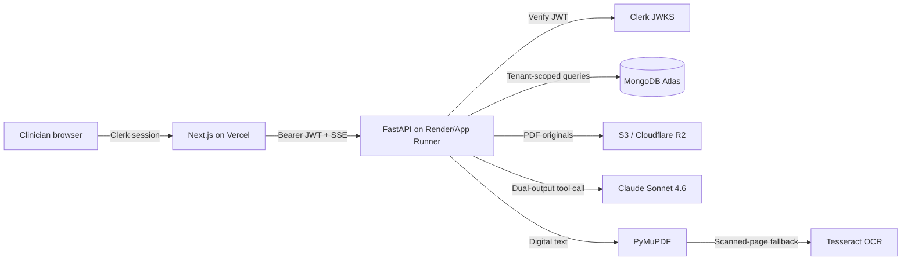

# MediNotes Pro

AI-assisted clinical documentation that converts pasted consultation notes or medical PDFs into two linked outputs:

- a structured, editable clinician summary
- an empathetic patient explanation written for an eighth-grade reading level

The patient handout also includes a **Teach-Back Check**: short questions patients can use to confirm they understood medications, follow-up, and urgent warning signs.

> **Clinical safety:** All generated content must be reviewed by a licensed clinician before clinical use. Patient explanations are generated from clinician notes and are not a substitute for direct medical advice.

## Architecture



Every database operation includes the authenticated Clerk `user_id`; API object IDs alone can never cross tenant boundaries. Files use hashed tenant prefixes and signed server-side access. No raw note text, extracted PDF text, output, filename, or token is written to application logs.

## Repository

```text
frontend/   Next.js 14 App Router, TypeScript, Tailwind, Clerk
backend/    FastAPI, MongoDB, Claude, PDF/OCR, S3/R2
infra/      Render blueprint and demo seed data
```

## Local setup

Requirements: Node 20+, Python 3.11+, Docker, and Tesseract (`brew install tesseract` on macOS).

1. Copy environment templates:

   ```bash
   cp backend/.env.example backend/.env
   cp frontend/.env.example frontend/.env.local
   ```

2. Set `DEV_AUTH_BYPASS=true` only for local curl testing. It is rejected in staging and production.
3. Start the full stack:

   ```bash
   docker compose up --build
   ```

The web app is at `http://localhost:3000`, the API at `http://localhost:8000`, and OpenAPI docs at `http://localhost:8000/docs`.

### Backend-first curl check

```bash
curl -sS -X POST http://localhost:8000/api/documents \
  -H 'Content-Type: application/json' \
  -d '{"title":"Follow-up","text":"54F BP 152/92. Increase lisinopril to 20 mg. BMP in 2 weeks."}'

curl -N -X POST http://localhost:8000/api/documents/DOCUMENT_ID/summarize
curl -N http://localhost:8000/api/documents/DOCUMENT_ID/stream
```

With Clerk enabled, add `Authorization: Bearer <session-token>`.

## Environment variables

### Backend

| Variable | Purpose |
|---|---|
| `ENVIRONMENT` | `development`, `test`, `staging`, or `production` |
| `MONGODB_URI` / `MONGODB_DATABASE` | MongoDB Atlas connection and database |
| `ANTHROPIC_API_KEY` | Claude API key |
| `ANTHROPIC_MODEL` | Defaults to `claude-sonnet-4-6` |
| `CLERK_ISSUER` / `CLERK_AUDIENCE` | JWT verification settings |
| `CORS_ORIGINS` | Comma-separated trusted frontend origins |
| `STORAGE_BACKEND` | `local` or `s3` |
| `S3_BUCKET`, `S3_ENDPOINT_URL`, `S3_REGION` | AWS S3 or R2 destination |
| `S3_ACCESS_KEY_ID`, `S3_SECRET_ACCESS_KEY` | Object-store credentials |
| `ADMIN_USER_IDS` | Comma-separated Clerk IDs allowed to view aggregate stats |
| `DEV_AUTH_BYPASS` | Local-only authentication bypass |

### Frontend

| Variable | Purpose |
|---|---|
| `NEXT_PUBLIC_API_URL` | Public FastAPI origin |
| `NEXT_PUBLIC_CLERK_PUBLISHABLE_KEY` | Clerk publishable key |
| `CLERK_SECRET_KEY` | Clerk server key |

See each `.env.example` for the complete list.

## AI pipeline and guardrails

Claude receives one combined tool schema containing independent `clinical` and `patient_facing` objects. The API validates both objects before persistence and reports progress over SSE. Outputs retain provenance, generation status, token/cost telemetry, and clinical edit history. Editing a clinical summary marks its patient explanation stale and allows regeneration.

Prompt and API guardrails prohibit invented facts, require uncertainty to remain explicit, separate urgent warnings from routine follow-up, and never silently convert model output into a signed clinical record. This repository is a secure engineering baseline, not by itself a HIPAA certification; production use requires appropriate BAAs, access policies, retention rules, audit review, backups, and incident procedures.

## Tests

```bash
cd backend
python -m venv .venv && source .venv/bin/activate
pip install -e '.[test]'
pytest

cd ../frontend
npm ci
npm run lint
npm run typecheck
npm run build
```

Demo examples are in `infra/seed_samples.json`.

## Deployment

### Frontend — Vercel

Import this GitHub repository, set the root directory to `frontend`, add the frontend environment variables, and deploy. Set `NEXT_PUBLIC_API_URL` to the HTTPS backend URL.

### Backend — Render

Create a Blueprint using `infra/render.yaml`, add the secret environment variables, and use a paid autoscaling-capable plan for production. Install Atlas network access, object storage, Clerk, and Anthropic credentials before enabling traffic.

GitHub Actions runs backend tests, frontend lint/type/build, and a Docker build. After successful CI on `main`, deployment uses these repository secrets:

- `VERCEL_TOKEN`, `VERCEL_ORG_ID`, `VERCEL_PROJECT_ID`
- `RENDER_DEPLOY_HOOK_URL`

Vercel automatically scales the frontend. Render/App Runner scales the OCR-capable container independently; placing Tesseract inside Vercel Functions is intentionally avoided because binary size, execution time, and memory limits make scanned-document processing unreliable.

## Data isolation

MongoDB stores shared collections with an immutable `user_id` tenant key and compound indexes such as `{user_id, created_at}`. This provides scalable isolation while retaining efficient search and pagination. Creating one physical file per user is not used: it is not a MongoDB isolation primitive and would make backups, indexes, connections, and autoscaling less reliable.
